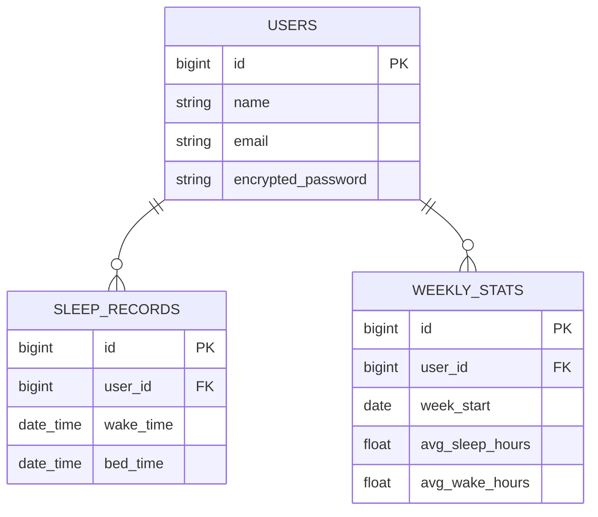

# Sleep Summit - 生活リズムを「登山」で整えるアプリ

---

## プロジェクト概要

**Sleep Summit** は、起床時間と睡眠時間を記録して生活リズムを整えるWebアプリケーションです。

### コンセプト

起床時にはグラフが上昇し、睡眠時にはグラフが下降する動きを、**まるで登山のように視覚化**します。
この「山を登る」イメージにより、生活リズムを正すことで自然とグラフの頂上を目指したくなる心理効果を生み出します。

> プログラミングを始めてから自分の生活リズムが乱れていることを実感しました。既存の睡眠記録アプリはありますが、「登山」というユニークなアプローチで生活習慣の改善をより効果的にサポートできると考えています。

### ターゲット層

生活リズムが乱れている全てのユーザー：
- 不規則な生活をしている方　など

---

## 実装済み機能（v1.0 リリース）

### ユーザー認証・管理
- メール/パスワード登録・ログイン
- Google OAuth2認証対応
- ユーザープロフィール管理
- アバター選択機能

### 睡眠・起床記録機能
- 起床時間の記録
- 睡眠時間の記録
- 過去日付のレコード編集・削除
- 当日以降の編集・追加の制限（データ整合性確保）
- フォーム入力の前日以前への制限

### ダッシュボード・ビジュアライゼーション
- 週単位の「登山グラフ」表示
  - 起床時間に応じたグラフの上昇
  - 睡眠時間に応じたグラフの下降
  - 累積時間の視覚化
- 週間統計情報
  - 平均起床時間
  - 平均睡眠時間
  - 平均起床時刻・就寝時刻
  - 日別の詳細表示

### 履歴・分析機能
- 月別履歴ページ
- 月ごとのグラフ表示
- 過去データの閲覧・編集

### Google Calendar連携
- Google Calendar APIとの連携
- ダッシュボードでの本日のカレンダーイベント表示

### 多言語対応
- 日本語完全対応
- Deviseの日本語ローカライゼーション
- Rails i18n対応

---

## 技術スタック

### Backend
| 技術 | バージョン | 用途 |
|------|-----------|------|
| **Ruby** | 3.4.2 | プログラミング言語 |
| **Rails** | 7.2.2+ | Webフレームワーク |
| **PostgreSQL** | Latest | リレーショナルDB |
| **Devise** | Latest | ユーザー認証 |
| **OmniAuth** | Latest | Google OAuth2連携 |
| **Google APIs** | calendar_v3 | Calendar API統合 |
| **Groupdate** | Latest | 日付グループ化 |

### Frontend
| 技術 | バージョン | 用途 |
|------|-----------|------|
| **Node.js** | 20.19.4 | JavaScriptランタイム |
| **Tailwind CSS** | 4.1.12 | CSSフレームワーク |
| **DaisyUI** | 5.0.54 | UIコンポーネント |
| **Stimulus.js** | 3.2.2 | JavaScriptフレームワーク |
| **Hotwired Turbo** | 8.0.16 | SPA風ページ高速化 |
| **Chartkick** | 5.0.1 | チャート表示補助 |
| **Highcharts** | 12.4.0 | チャート描画 |
| **esbuild** | 0.25.9 | JavaScriptバンドラ |

### 開発ツール
| ツール | 用途 |
|--------|------|
| **Docker** | 開発環境の一貫性確保 |
| **RSpec** | ユニットテスト・インテグレーションテスト |
| **Factory Bot** | テストデータ生成 |
| **Rubocop** | Ruby/Railsコード品質 |
| **Brakeman** | セキュリティ脆弱性スキャン |

---

## 使い始める

1. **アプリにアクセス**
   - ブラウザで本アプリのURLにアクセスしてください

2. **アカウント作成**
   - メールアドレスとパスワードで登録、またはGoogleアカウントで連携

3. **睡眠記録開始**
   - 起床時にダッシュボードの「起床」ボタンを押す
   - 睡眠時に「睡眠」ボタンを押す
   - グラフが自動的に更新されます

4. **進捗確認**
   - ダッシュボード：今週の「登山グラフ」を確認
   - 履歴：過去の記録を月別で確認

---

## セキュリティ機能

- CSRF保護（Rails + omniauth-rails_csrf_protection）
- パスワードの暗号化（Devise）
- データベースインジェクション対策
- 当日以降のレコード編集禁止による不正操作防止
- 定期的なセキュリティスキャン（Brakeman）

---

## 今後の予定（v2.0以降）

- ステージ形式の登山（富士山、エベレストなど）
- ユーザー間のランキング機能
- LINE通知機能による起床・睡眠リマインダー
- 睡眠記録押し忘れ対策の自動アラート
- 複数デバイス対応（PC・スマホの完全連携）
- SNS共有機能

---

## サポート・問い合わせ

https://sleep-summit.jp/contact

---

## デザイン・UX資料

- **画面遷移図**: [Figma Design](https://www.figma.com/design/zZkNgGON7zrTQuTi67yt1d/Sleep-Summit?node-id=0-1&t=AVlGwjVE7OLlMx4X-1)
- **ER図**: [Mermaid Chart](https://www.mermaidchart.com/app/projects/d407c7c4-f5e3-4018-9df8-e2186c016c46/diagrams/05ed6f75-7201-425d-b705-349f547ce8ab/version/v0.1/edit)

---

**最終更新**: 2024年12月
**バージョン**: v1.0.0

---
### 画面遷移図
https://www.figma.com/design/zZkNgGON7zrTQuTi67yt1d/Sleep-Summit?node-id=0-1&t=AVlGwjVE7OLlMx4X-1
---
### ER図
https://www.mermaidchart.com/app/projects/d407c7c4-f5e3-4018-9df8-e2186c016c46/diagrams/05ed6f75-7201-425d-b705-349f547ce8ab/version/v0.1/edit

---

